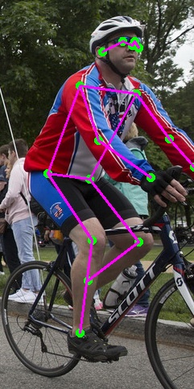

## Deploy Lite-HRNet with TensorRT and C++.

Use [mmpose](https://github.com/open-mmlab/mmpose) instead of [Lite-HRNet](https://github.com/HRNet/Lite-HRNet).

Environment:

- mmcv-full                 1.7.0
- mmpose                    0.29.0
- onnx                      1.12.0
- python                    3.9.7
- pytorch                   1.8.0
- onnxsim                   0.4.10

1. Modify mmpose/tools/deployment/pytorch2onnx.py to support dynamic batch:

```
    torch.onnx.export(
        model,
        one_img,
        output_file,
        export_params=True,
        keep_initializers_as_inputs=True,
        verbose=show,
        opset_version=opset_version,
        input_names=["image"],
        output_names=["heatmap"],
        dynamic_axes={
            "image": {0: "batch"},
            "heatmap": {0: "batch"}
        })
```

2. Download pth model from [here](https://mmpose.readthedocs.io/en/latest/papers/backbones.html#litehrnet-cvpr-2021). 
3. Convert pth model to ONNX model:

```
python tools/deployment/pytorch2onnx.py configs/body/2d_kpt_sview_rgb_img/topdown_heatmap/coco/litehrnet_30_coco_384x288.py litehrnet30_coco_384x288-a3aef5c4_20210626.pth --output-file litehrnet_30_coco_384x288-dynamic.onnx --verify --shape 1 3 384 288
```

If get error like: 

> RuntimeError: Failed to export an ONNX attribute 'onnx::Gather', since it's not constant, please try to make things (e.g., kernel size) static if possible

add `mini_size = [int(v) for v in mini_size]` after [this line](https://github.com/open-mmlab/mmpose/blob/afb37d4ce74a2df32a68c3e66a4411e515de423f/mmpose/models/backbones/litehrnet.py#L118) to  may resolve this.

If get error:

> NotImplementedError: [Adaptive pool]:input size not accessible

just try PyTorch==1.8.0.

4. Simplify ONNX model:

```
python -m onnxsim litehrnet_30_coco_384x288-dynamic.onnx litehrnet_30_coco_384x288-dynamic-sim.onnx 2 --test-input-shape image:1,3,384,288
```

5. Serialize TensorRT engine:

```
trtexec --onnx=litehrnet_30_coco_384x288-dynamic-sim.onnx --saveEngine=litehrnet_30_coco_384x288-dynamic.trt --explicitBatch --minShapes=image:1x3x384x288  --optShapes=image:16x3x384x288  --maxShapes=image:64x3x384x288 --shapes=image:16x3x384x288 --workspace=1024
```

6. Run engine file with this project and get results below, it takes around 950ms with batch=64 on GTX 1050 Ti GPU.

   
